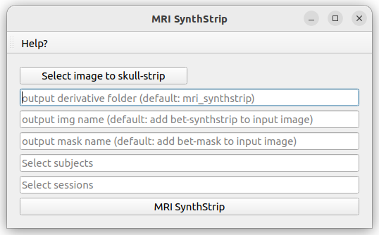

# MRI Syntstrip
Skull-stripping pipeline using mri_synthstrip (FreeSurfer)

## Requirements

**FreeSurfer**
Either FreeSurfer already installed on the user's computer

Or using the docker freesurfer:7.3.2

You can choose which one to run by switching the option in the mri_synthstrip.json file

## How to cite

1. Fischl B, Salat DH, Busa E, Albert M, Dieterich M, Haselgrove C, et al. Whole Brain Segmentation: Automated Labeling of Neuroanatomical Structures in the Human Brain. Neuron. 2002 Jan 31;33(3):341–55.

## Utilization

The first figure below shows the window of this pipeline. This window contains the following information:

* "Select image to skull-strip": open File explorer to select the image to skull-strip

* "output derivative": name of the derivative folder to save the results of the pipeline (default: mri_synthstrip)

* "output img name": name of the output skull-stripped img (default: add bet-synthstrip to input image name)

* "output mask name" name of the output skull-stripped mask (default: add bet-mask to input image name)

* "Select subjects" input: allows the user to script the automatic segmentation for subjects of the dataset by adding a list BIDS ID (without "sub-") separated by a comma. Possible values are: single BIDS ID (e.g. "001,002,006,013"), multiple folowing BIDS ID (e.g. "001-005" is the same as '001,002,003,004,005"), or all subjects ("all").

* "Select sessions" input: allows the user to script the automatic segmentation for sessions of subjects of the dataset by adding a list session ID (without "ses-") separated by a comma. Possible values are: single session ID (e.g. "01,02,06,13"), multiple folowing session ID (e.g. "01-05" is the same as '01,02,03,04,05"), or all sessions ("all").

* "MRI SynthStrip" button: launch the skull-stripping pipeline

*Typically, a segmentation takes about 5 minutes*

## Change pipeline option

In the mri_synthstrip.json file, the user can choose some option to run SAMEG:

* "use_docker": choose to run the pipeline locally using the docker image (true) or locally installed FreeSurfer (default: false)

* "sss_slurm": precise the config file to run the pipeline on the SSS server (specific to UCLouvain members). If this tag does not exists (by default: "sss_slurm_no"), it will run the pipeline locally. To use this pipeline on remote server, change the name "sss_slurm_no" to "sss_slurm", and adapt the config file "mri_synthstrip_sss.json" for your specific slurm need. This works with a correct "server_info.json" config file in the BMAT home directory.

